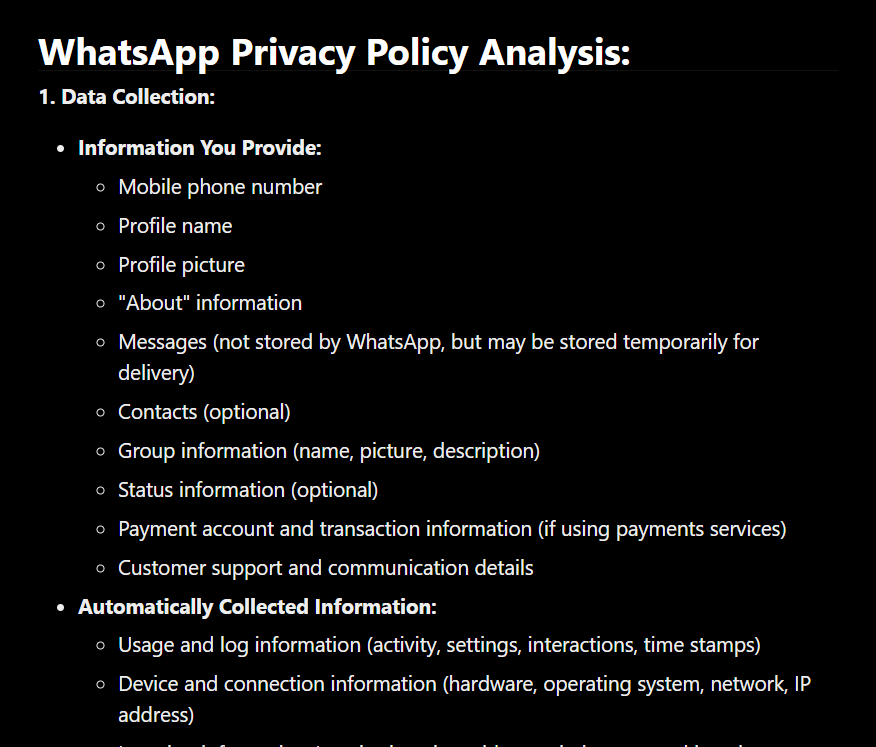
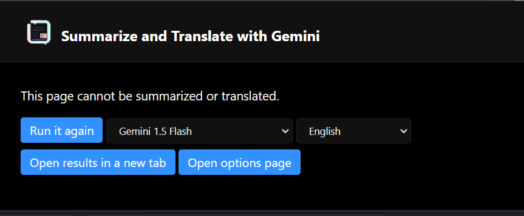

# PolicyLens
# extension-summarize-translate-gemini

Chrome extension to summarize and translate web pages. Uses Gemini as the backend.

## Setup

1. Open 'Manage Extensions' page in Google Chrome browser.
2. Enable 'Developer mode'.
3. Click 'Load unpacked' and select `extension` directory.
4. Open 'Options' page and register the Gemini API Key, then select the language.

You can obtain a Gemini API Key from [Google AI for Developers](https://ai.google.dev/).
This extension currently uses following models:

- Gemini 1.5 Pro Experimental 0801: Gemini 1.5 Pro Experimental 0801 for text and images
- Gemini 1.5 Pro: Gemini 1.5 Pro for text and images
- Gemini 1.5 Flash: Gemini 1.5 Flash for text and images
- Gemini 1.0 Pro: Gemini 1.0 Pro for text and Gemini 1.5 Flash for images

## Usage

### Summarize

Some sample sceenshots

### Translate

Select the text you want to translate and click on the extension icon.

## License

MIT License  
Copyright (c) 2024 Sadao Hiratsuka
